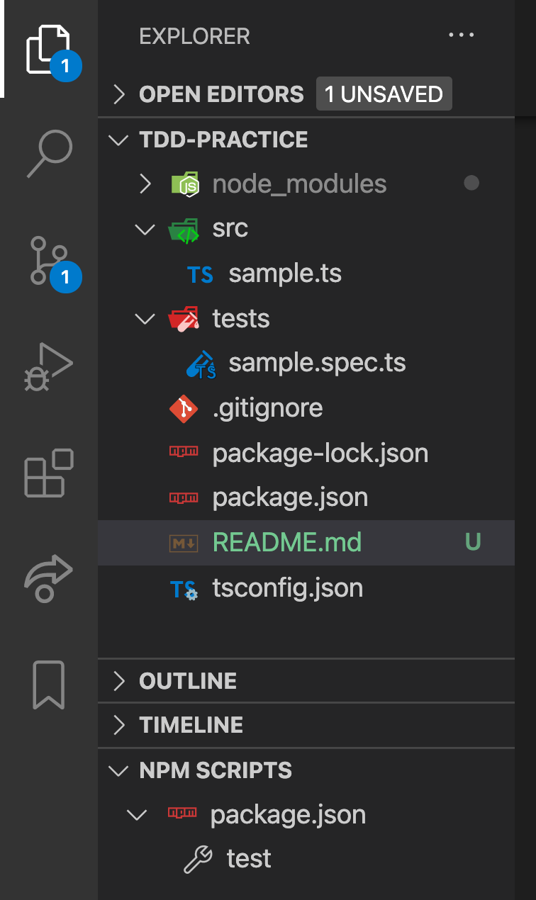
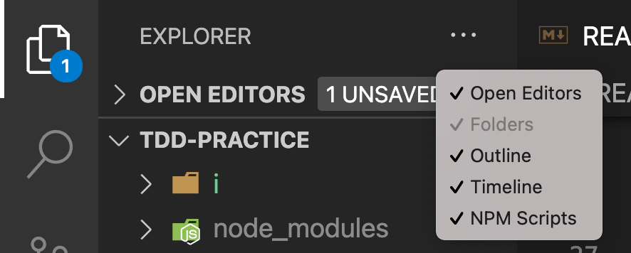

# TDD PRACTICE

TDD の練習問題です。

## 環境

- npm
- TypeScript
- jest

です

## インストール

本リポジトリを clone 後、本リポジトリのルートディレクトリにて以下のコマンドを実行してください。

```command
npm install
```

## テスト実行

package.json には以下のスクリプトが登録されています。

```json
  "scripts": {
    "test": "jest tests/"
  },
```

### 実行方法

VSCode の Explorer 下部にある「NPM SCRIPTS」から実行できます。



「NPM SCRIPTS」は、デフォルトでは表示されていないので、Explorer の右上にある「・・・」をクリックして表示されるメニューから「NPM SCRIPTS」をチェックして有効にしてください。


